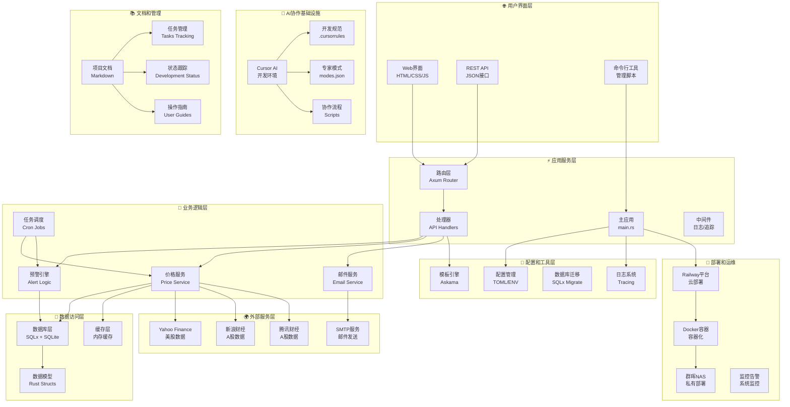
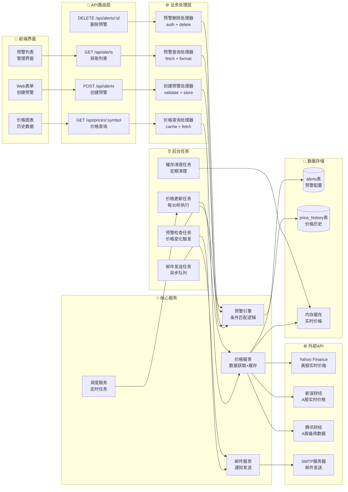
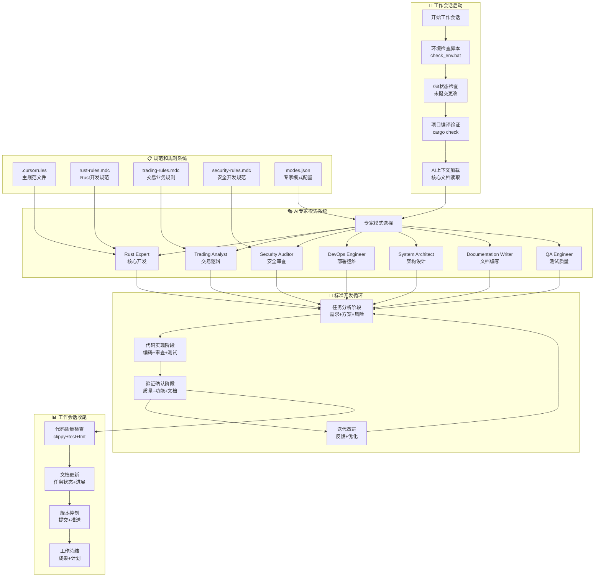

# 🏗️ TradeAlertRust 项目架构文档

> 📋 **文档版本**: v2.0  
> 📅 **更新日期**: 2025-01-09  
> 🎯 **涵盖范围**: 完整系统架构 + AI协作基础设施  

## 📖 **架构概览**

TradeAlertRust是一个基于Rust构建的智能交易预警系统，采用现代化的微服务架构设计，集成了完整的AI协作开发基础设施。系统支持多市场（美股、A股、加密货币）的实时价格监控和智能预警功能。

### **🎯 核心特性**
- **多市场支持**: 美股(Yahoo Finance) + A股(新浪/腾讯财经)
- **实时监控**: 30秒级价格更新和预警检查
- **智能通知**: 邮件预警 + 多渠道通知
- **AI协作**: 完整的AI辅助开发工作流程
- **云原生**: 支持Railway、Docker、群晖NAS部署

---

## 🏛️ **系统整体架构**

### **分层架构设计**



---

## 🔄 **数据流架构**

### **请求处理和数据流向**



---

## 🤖 **AI协作基础设施架构**

### **完整的AI辅助开发工作流程**



---

## 📁 **项目目录结构架构**

### **完整的项目组织结构**

```mermaid
graph TB
    %% 项目目录结构架构
    subgraph "📁 项目根目录 - TradeAlertRust"
        ROOT[TradeAlertRust/]
    end

    subgraph "🦀 Rust核心代码"
        SRC[src/<br/>源代码目录]
        CARGO[Cargo.toml<br/>项目配置]
        
        subgraph "源代码模块"
            MAIN[main.rs<br/>应用入口]
            CONFIG_RS[config.rs<br/>配置管理]
            DB_RS[db.rs<br/>数据库层]
            MODELS_RS[models.rs<br/>数据模型]
            FETCHER_RS[fetcher.rs<br/>价格获取]
            EMAIL_RS[email.rs<br/>邮件服务]
        end
    end

    subgraph "🤖 AI协作基础设施"
        CURSOR_DIR[.cursor/<br/>AI配置目录]
        CURSORRULES[.cursorrules<br/>主规范文件]
        
        subgraph "AI配置文件"
            MODES_JSON[modes.json<br/>专家模式]
            RULES_DIR[rules/<br/>规则目录]
        end
    end

    subgraph "📚 文档系统"
        DOCS[docs/<br/>文档目录]
        
        subgraph "核心文档"
            START_HERE_FILE[START_HERE.md<br/>启动指南]
            WORKFLOW_FILE[ai-collaboration-workflow.md<br/>协作流程]
            ARCHITECTURE_FILE[PROJECT_ARCHITECTURE.md<br/>架构文档]
        end
    end

    subgraph "📋 任务和状态管理"
        TASKS[tasks/<br/>任务目录]
        CURRENT_TASKS_FILE[current-tasks.md<br/>当前任务]
        DEV_STATUS_FILE[development-status.md<br/>开发状态]
    end

    subgraph "🔧 脚本和工具"
        SCRIPTS[scripts/<br/>脚本目录]
        
        subgraph "开发脚本"
            START_SESSION[start_work_session.bat]
            END_SESSION[end_work_session.bat]
            CHECK_ENV[check_env.bat]
        end
    end

    subgraph "🗄️ 数据和配置"
        DATA[data/<br/>数据目录]
        MIGRATIONS[migrations/<br/>数据库迁移]
        CONFIG_TOML[config.toml.example<br/>配置模板]
    end

    subgraph "🚀 部署和容器"
        DOCKER_DIR[docker/<br/>Docker配置]
        SYNOLOGY[synology/<br/>群晖部署]
        RAILWAY_TOML[railway.toml<br/>Railway配置]
    end

    %% 连接关系
    ROOT --> SRC
    ROOT --> CURSOR_DIR
    ROOT --> DOCS
    ROOT --> TASKS
    ROOT --> SCRIPTS
    ROOT --> DATA
    ROOT --> DOCKER_DIR
    
    SRC --> MAIN
    SRC --> CONFIG_RS
    SRC --> DB_RS
    SRC --> MODELS_RS
    SRC --> FETCHER_RS
    SRC --> EMAIL_RS
    
    CURSOR_DIR --> MODES_JSON
    CURSOR_DIR --> RULES_DIR
    
    DOCS --> START_HERE_FILE
    DOCS --> WORKFLOW_FILE
    DOCS --> ARCHITECTURE_FILE
    
    TASKS --> CURRENT_TASKS_FILE
    DOCS --> DEV_STATUS_FILE
    
    SCRIPTS --> START_SESSION
    SCRIPTS --> END_SESSION
    SCRIPTS --> CHECK_ENV
```



---

## 🔧 **技术栈详解**

### **🦀 后端技术栈**
```yaml
核心框架:
  - Rust: 1.85+ (系统编程语言)
  - Axum: 0.7 (Web框架)
  - Tokio: 1.0 (异步运行时)

数据存储:
  - SQLite: 数据库引擎
  - SQLx: 0.8 (数据库ORM)
  - 内存缓存: HashMap + RwLock

外部集成:
  - Reqwest: 0.11 (HTTP客户端)
  - Serde: 1.0 (序列化/反序列化)
  - Lettre: 0.11 (邮件发送)

工具链:
  - Tracing: 日志和追踪
  - Anyhow/Thiserror: 错误处理
  - Chrono: 时间处理
  - Askama: 模板引擎
```

### **🌐 前端技术栈**
```yaml
模板引擎:
  - Askama: Rust模板引擎
  - HTML5: 标准标记语言
  - CSS3: 样式设计
  - JavaScript: 交互逻辑

API接口:
  - REST API: JSON格式
  - HTTP状态码: 标准化响应
  - CORS支持: 跨域访问
```

### **☁️ 部署技术栈**
```yaml
容器化:
  - Docker: 容器技术
  - Docker Compose: 容器编排

云平台:
  - Railway: 主要云部署平台
  - 群晖NAS: 私有化部署选项

监控运维:
  - Tracing: 应用监控
  - 结构化日志: JSON格式
  - 健康检查: HTTP端点
```

---

## 📊 **性能指标和监控**

### **🎯 关键性能指标**
```yaml
响应时间:
  - API响应: < 100ms (95th percentile)
  - 价格更新: 30秒间隔
  - 预警检查: < 5秒

并发处理:
  - 最大并发请求: 100/秒
  - 数据库连接池: 10个连接
  - HTTP客户端池: 复用连接

资源使用:
  - 内存占用: < 100MB
  - CPU使用: < 10% (空闲时)
  - 磁盘空间: < 50MB (数据库)
```

### **📈 监控体系**
```yaml
应用监控:
  - 结构化日志: Tracing框架
  - 错误追踪: 完整堆栈信息
  - 性能指标: 响应时间统计

业务监控:
  - 预警触发率: 成功/失败统计
  - 价格更新频率: 数据源可用性
  - 邮件发送状态: 通知成功率

系统监控:
  - 资源使用: CPU/内存/磁盘
  - 网络连接: 外部API可用性
  - 数据库性能: 查询执行时间
```

---

## 🔒 **安全架构**

### **🛡️ 安全措施**
```yaml
数据保护:
  - 敏感信息: 环境变量存储
  - 数据传输: HTTPS强制加密
  - 数据存储: SQLite文件权限控制

输入验证:
  - API参数: 严格类型检查
  - SQL注入: 参数化查询
  - XSS防护: 模板自动转义

访问控制:
  - API限流: 防止滥用
  - 错误处理: 不泄露内部信息
  - 日志安全: 敏感信息脱敏
```

### **🔐 配置安全**
```yaml
环境变量:
  - 数据库URL: TRADE_ALERT__DATABASE__URL
  - SMTP密码: TRADE_ALERT__EMAIL__SMTP_PASSWORD
  - API密钥: 外部服务认证

文件权限:
  - 配置文件: 只读权限
  - 数据库文件: 应用独占
  - 日志文件: 受限访问
```

---

## 🚀 **部署架构**

### **☁️ 云部署 (Railway)**
```yaml
环境配置:
  - 自动构建: Git推送触发
  - 环境变量: Railway面板配置
  - 域名绑定: 自动HTTPS证书

资源配置:
  - CPU: 共享vCPU
  - 内存: 512MB
  - 存储: 持久化磁盘
  - 网络: 全球CDN
```

### **🏠 私有部署 (群晖NAS)**
```yaml
容器部署:
  - Docker Compose: 服务编排
  - 数据持久化: NAS存储
  - 网络配置: 内网访问

安全配置:
  - 防火墙: 端口访问控制
  - SSL证书: Let's Encrypt
  - 备份策略: 定期数据备份
```

---

## 📋 **开发和维护**

### **🔄 开发工作流程**
```yaml
代码开发:
  1. 环境检查: scripts/development/check_env.bat
  2. AI协作: 选择专家模式
  3. 代码实现: 遵循.cursorrules规范
  4. 质量检查: cargo check/clippy/test/fmt
  5. 文档更新: 同步更新相关文档
  6. 版本控制: Git提交和推送

任务管理:
  - 任务跟踪: tasks/current-tasks.md
  - 进度状态: docs/development-status.md
  - 里程碑: 阶段完成总结
```

### **🧪 测试策略**
```yaml
单元测试:
  - 业务逻辑: 核心算法测试
  - 数据模型: 序列化/反序列化
  - 工具函数: 边界条件测试

集成测试:
  - API端点: 完整请求响应流程
  - 数据库: CRUD操作验证
  - 外部服务: Mock和真实API测试

端到端测试:
  - 用户场景: 完整业务流程
  - 部署验证: 生产环境功能测试
```

---

## 🎯 **未来架构演进**

### **📈 扩展计划**
```yaml
功能扩展:
  - 多策略引擎: 支持复杂交易策略
  - 实时WebSocket: 价格推送优化
  - 移动端API: 原生应用支持
  - 机器学习: 智能预警优化

技术升级:
  - 微服务化: 服务拆分和独立部署
  - 消息队列: 异步任务处理
  - 分布式缓存: Redis集群
  - 负载均衡: 高可用架构

AI协作增强:
  - 智能代码生成: 更高级的AI辅助
  - 自动化测试: AI生成测试用例
  - 性能优化: AI驱动的性能调优
  - 文档智能: 自动文档生成和维护
```

---

## 📞 **相关文档**

### **📚 核心文档链接**
- [项目启动指南](START_HERE.md) - 每次对话必读
- [AI协作工作流程](ai-collaboration-workflow.md) - 详细协作流程
- [开发状态跟踪](development-status.md) - 项目进展状态
- [当前任务管理](../tasks/current-tasks.md) - 任务跟踪
- [配置管理规则](technical/CONFIGURATION_MANAGEMENT.md) - 配置规范

### **🔧 技术文档**
- [数据库迁移指南](DATABASE_MIGRATION_GUIDE.md) - 数据库管理
- [部署指南](deployment/) - 各种部署方式
- [开发指南](development/) - 开发环境设置

---

**📝 文档维护**: 本架构文档随项目发展持续更新  
**🔄 更新频率**: 重大架构变更时更新  
**�� 维护者**: AI助手 + 开发团队 