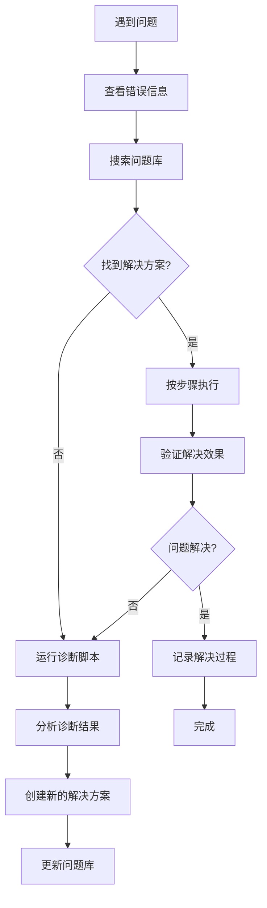

# 🔧 TradeAlert 常见问题库 (FAQ & Troubleshooting)

> **快速解决开发和部署中的常见问题**

## 📚 问题分类索引

### 🚀 [启动和运行问题](./startup-issues.md)
- 服务器启动失败
- 端口占用问题
- 环境变量配置
- 数据库连接问题

### 🔨 [编译和构建问题](./build-issues.md)
- SQLX离线模式错误
- Rust编译错误
- 依赖包问题
- 生命周期错误

### 🗄️ [SQLx 编译问题](./sqlx-compilation-issues.md)
- 查询缓存缺失错误
- 类型转换错误 
- nullable 字段处理
- 参数绑定问题

### 🌐 [API和网络问题](./api-issues.md)
- API调用失败
- 股票数据获取错误
- 网络超时问题
- CORS跨域问题

### 💾 [数据库问题](./database-issues.md)
- 迁移失败
- 数据丢失
- 查询性能问题
- SQLite锁定问题

### 🎨 [前端和模板问题](./frontend-issues.md)
- JavaScript错误
- 模板渲染问题
- 样式显示异常
- 移动端适配问题

### 📧 [邮件通知问题](./email-issues.md)
- SMTP配置错误
- 邮件发送失败
- 邮件格式问题
- 垃圾邮件过滤

### 🏗️ [部署和环境问题](./deployment-issues.md)
- Railway部署失败
- Docker容器问题
- 环境变量配置
- 域名和SSL问题

## 🔍 快速诊断工具

### 一键诊断脚本
```powershell
# 运行完整系统诊断
./scripts/diagnose.ps1

# 检查特定组件
./scripts/check-server.ps1
./scripts/check-database.ps1
./scripts/check-api.ps1
```

### 常用检查命令
```bash
# 检查服务器状态
netstat -ano | findstr :3000

# 检查数据库
sqlite3 data/trade_alert.db ".tables"

# 检查环境变量
echo $env:SQLX_OFFLINE
```

## 📊 问题统计和趋势

| 问题类型 | 频率 | 解决难度 | 平均解决时间 |
|---------|------|----------|-------------|
| 端口占用 | ⭐⭐⭐⭐⭐ | 🟢 简单 | 1分钟 |
| SQLX错误 | ⭐⭐⭐⭐ | 🟡 中等 | 5分钟 |
| 模板错误 | ⭐⭐⭐ | 🟡 中等 | 10分钟 |
| API配置 | ⭐⭐ | 🔴 困难 | 30分钟 |

## 🆘 紧急救援指南

### 🚨 服务器无法启动
1. **立即检查**: [端口占用解决方案](./startup-issues.md#port-occupied)
2. **备用方案**: [更换端口配置](./startup-issues.md#change-port)
3. **最后手段**: [完全重置环境](./startup-issues.md#reset-environment)

### 🚨 数据库损坏
1. **立即备份**: [数据库备份脚本](./database-issues.md#backup)
2. **尝试修复**: [SQLite修复工具](./database-issues.md#repair)
3. **重建数据库**: [完整重建流程](./database-issues.md#rebuild)

### 🚨 生产环境故障
1. **快速回滚**: [版本回滚指南](./deployment-issues.md#rollback)
2. **紧急修复**: [热修复流程](./deployment-issues.md#hotfix)
3. **监控恢复**: [服务监控检查](./deployment-issues.md#monitoring)

## 📈 问题解决流程



## 🤝 贡献指南

### 添加新问题解决方案
1. 在相应分类文件中添加问题描述
2. 提供详细的解决步骤
3. 包含代码示例和截图
4. 标注难度等级和预估时间

### 问题模板
```markdown
## 问题标题
**症状**: 具体的错误现象
**原因**: 问题产生的根本原因  
**解决方案**: 详细的解决步骤
**预防措施**: 如何避免再次发生
**相关链接**: 参考资料和文档
```

## 📞 获取帮助

- 📖 **文档**: [项目文档](../../README.md)
- 💬 **讨论**: [GitHub Issues](https://github.com/your-repo/issues)
- 📧 **联系**: [support@tradealert.com](mailto:support@tradealert.com)
- 🔧 **诊断**: [在线诊断工具](http://localhost:3000/diagnostic)

---

**最后更新**: 2025-06-21  
**维护者**: TradeAlert 开发团队  
**版本**: v2.1 